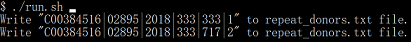
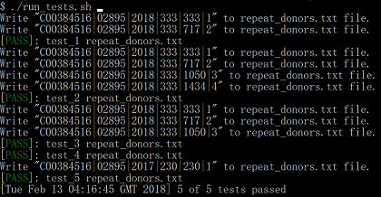

# Libraries and Enviroments
1. Python 3.6.3
2. Anaconda 4.3.33 (or numpy 1.14.0 and pandas 0.22.0)

# Where to run program:

**[Repo Root path]/run.sh**

# Repo directory structure

the only different is that I add **donation-analytics.py** file to origin Insight Repo.

and also the added 6 testcases.

The directory structure:

    ├── README.md 
    ├── run.sh
    ├── src
    │   └── donation-analytics.py
    ├── input
    │   └── percentile.txt
    │   └── itcont.txt
    ├── output
    |   └── repeat_donors.txt
    ├── insight_testsuite
        └── run_tests.sh
        └── tests
            └── test_1
            |   ├── input
            |   │   └── percentile.txt
            |   │   └── itcont.txt
            |   |__ output
            |       └── repeat_donors.txt
            └── test_2
            |   ├── input
            |   │   └── percentile.txt
            |   │   └── itcont.txt
            |   |__ output
            |       └── repeat_donors.txt            
             └── test_3
            |   ├── input
            |   │   └── percentile.txt
            |   │   └── itcont.txt
            |   |__ output
            |       └── repeat_donors.txt 
             └── test_4
            |   ├── input
            |   │   └── percentile.txt
            |   │   └── itcont.txt
            |   |__ output
            |       └── repeat_donors.txt 
            └── test_5
                ├── input
                │   └── percentile.txt
                │   └── itcont.txt
                |__ output
                    └── repeat_donors.txt                    
            
   
 # Testing the directory structure and output format
 
 run test command  **<[donation-analytics]>/insight_testsuite/run_tests.sh **
 and the results show the program pass all the 6 test cases. 
 
  
 
